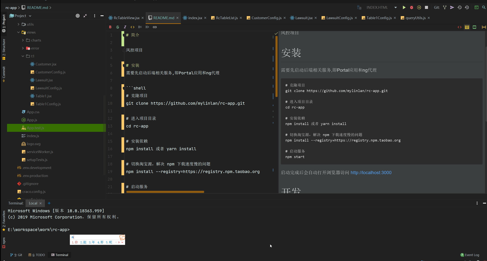

# 简介

风控项目。

技术栈如下：
+ [React](https://react.docschina.org/)
+ [Antd](https://ant.design/docs/react/introduce-cn)

原本打算使用vue+element ui，原因是portal使用了vue。但是element ui表格固定列功能无法满足要求，且该项目貌似已停止维护。
因此转向react+antd。

# 目录结构
```bash
├─ public                      # 静态资源
│   ├─ favicon.ico             # favicon图标
│   └─ index.html              # html模板
├── src                        # 项目源码
│   ├── api                    # 所有请求
│   ├── assert                 # 图标、字体等静态资源
│   ├── components             # 全局公用组件
│   ├── config                 # 全局配置
│   │   └── routeMap.js        # 路由配置
│   ├── core                   # 项目启动代码
│   ├── env                    # 运行环境相关
│   │   └── polyfill.js        # 适应Portal-Web项目的的代码
│   ├── store                  # 全局 store管理
│   ├── style                  # 全局样式
│   ├── utils                  # 全局公用方法
│   ├── views                  # views 所有页面
│   │   ├── charts             # 图表页面如可视化报告
│   │   ├── error              # 错误页面
│   │   └── t1                 # 主表单一相关页面
│   ├──App.js                  # 入口页面
│   └──index.js                # 源码入口
├── .env.development           # 开发环境变量配置
├── .env.production            # 生产环境变量配置
├── craco.config.js            # 对cra的webpack自定义配置
└── package.json               # package.json

```
# 安装

```shell script
# 克隆项目
git clone https://github.com/mylinlan/rc-app.git

# 进入项目目录
cd rc-app

# 安装依赖
npm install 或者 yarn install

# 切换淘宝源，解决 npm 下载速度慢的问题
npm install --registry=https://registry.npm.taobao.org

# 启动服务
npm start
```

项目暂时没添加mock数据功能，因此需要先启动后端相关服务,即Portal应用和ng代理。
本机没有Portal应用的同学，可以修改一下接口配置,见[接口配置](#接口配置) 一节

启动完成后会自动打开浏览器访问 [http://localhost:3000](http://localhost:3000)， 将会看到以下页面：


# 部署
```shell script
# 打包构建
npm run build
```
然后将build目录下的文件覆盖Portal-Web目录下的modules/rc即可

# 开发

## 接口配置

如果本机没有Portal应用提供后端接口，可以替换```.env.development```文件配置如下：
```shell script
REACT_APP_BASE_API = 'http://172.30.25.8:8093/utrust'
```

注意，以上配置使用的是生产环境接口

## 样式修改
项目使用[less](http://lesscss.cn/) 处理样式。
就目前而言，修改样式主要包括两部分，一部分就是Antd组件的样式，另一部分就是自定义页面的样式

### 定制antd主题
在根目录下```craco.config.js```文件配置即可
```
    plugins: [
        {
            plugin: CracoLessPlugin,
            options: {
                lessLoaderOptions: {
                    // 可以在这里更改antd主题
                    // @see "https://ant.design/docs/react/use-with-create-react-app-cn"
                    lessOptions: {
                        modifyVars: {'@primary-color': '#1890ff'},
                        javascriptEnabled: true,
                    },
```

参考：
+ 官网[在 create-react-app 中使用](https://ant.design/docs/react/use-with-create-react-app-cn#自定义主题) ,
+ 官网[定制主题](https://ant.design/docs/react/customize-theme-cn) 

### 自定义样式
全局样式配置文件位于```src\style\index.less```, 自定义页面样式可直接新增一个less文件，然后在页面引入即可。
具体做法可参考可视化报告页面

页面
```javascript
// src\views\charts\index.jsx
import './index.less'
```

样式
```less
// src\views\charts\index.less
.chart-container{
  min-height: 399px;
  width: 100%;
  height: 100%;
  color: #333333;
  background: #F7F7F7;
  ...
}
```
## 路由配置
目前项目仍是一个单页面应用(SPA)，对于不同的页面使用[React-Router](https://reactrouter.com/web/guides/quick-start)
进行导航。具体的配置文件位于```src/config/routeMap.js```, 每新增一个页面均需要在这里配置路由。

为减少单文件体积，使用[react-loadable](https://www.npmjs.com/package/react-loadable) 分割代码。

## Rc通用表格配置

仅仅提供自定义的列表查询参数即可，部分固定参数如IN_MONTH、DATA_SOURCE会自动合并。

不提供筛选框的相关参数情况下，将会使用默认的筛选框存储过程配置。就目前而言，筛选框调用的存储过程都是一样的。
### 表格参数

- rowKey: 每一行的key, 默认为```nOrderId```
- showSearch: 是否显示搜索按钮, 默认为```undefined```，即如果有筛选框则显示，没有则不显示
- showAll: 不分页一次性查出所有记录(实际上把IN_ROW_END设置为100000)
### 公共参数：
以下参数为目前默认的公共参数，自定义时需要省略掉
```javascript
// 当前查询年月
export const lastYearMonth = [
    {name: 'IN_MONTH', type: 'VARCHAR2', value: "计算得到的上一个年月"}
]
// 存储过程通用参数
export const commonParams = [
    {name: 'IN_USER_GROUP', type: 'VARCHAR2', value: ""},
    {name: 'IN_DATA_SOURCE', type: 'VARCHAR2', value: DATA_SOURCE}
]
// 分页参数, 列表查询专用，筛选框查询不需提供
export const pageParams = [
    {name: 'IN_ROWNB_BEGIN', type: 'NUMBER', value: 0},
    {name: 'IN_ROWNB_END', type: 'NUMBER', value: 10}
]
// 存储过程输出参数名称
export const outParamName = 'OUT_DATASET'
```
### 自定参数：

- name: 存储过程对应的参数名
- type: 存储过程对应的参数类型
- defaultValue： 参数默认值, 一般而言, 该项应该与filter的defaultValue互斥存在
- filter: 列表查询参数专用。filter对应存在，即表明该项作为筛选框条件，用户可在前端输入值。以下filter参数一般与对应的Antd组件参数关联：
  + id： 筛选框标识, 应该唯一。值大小代表顺序, 请参考《接口文档》设置
  + code: code可根据id生成，如id为1的下拉框code为D001,作为IN_DIM_TYPE_CODE参数值传入存储过程
  + label: 筛选框控件label
  + searchOnChange: 控件值改变时执行搜索动作，默认为```false```
  + type: 筛选框类型，与antd组件对应，目前支持的type有
    * select(默认)
    * autoComplete
    * radio
    * input
  + defaultValue： 筛选框控件默认值
  + deps： 表示当前筛选框依赖其他筛选框的值,暂时只考虑支持一个依赖
  + 针对select下拉框的配置
    * skipInit: 是否跳过初始化，针对具有依赖关系，且数据量较大的下拉框。如果传入父值数据量仍旧很大，应该设置dynamic
    * dynamic: 如果值存在，即代表下拉框需动态生产，dynamic的值代表搜索值对应的存储过程参数
    * showSearch：单选模式下可搜索
  + 针对autoComplete的配置
    * dynamic: 如果值存在，即代表autoComplete候选项需动态生产，dynamic的值代表搜索值对应的存储过程参数
  + 针对radio的配置
    * options: radio的选项形如```[{value: 'xxKey',label:'xxValue'}...]``` 
为获取存储过程自定义参数，一般可以打开plsql查看具体的存储过程，复制到notepad++后直接进行列操作可得到该配置信息
 
## 适应Portal-Web
本项目作为一个单页面应用嵌入Portal-Web应用的iframe，因此一些功能函数和全局变量需要父窗口提供。

因为每个iframe页面的window对象不能共享，因此需要将项目用到的全局变量或函数挂载到父窗口window对象中。
在rc-app中则通过```window.parent```的方式调用。注意这些变量需要使用rc前缀，避免污染其他全局变量。

适应代码主要包括项目内部代码和外部代码

### 内部polyfill
在```src\env\polyfill.js```文件中对父窗口函数如打开新标签页进行改造，使得这些父窗口函数
可以平滑地应用到本项目中。

### 外部polyfill
在Portal-Web应用的```index.html```文件中引入了```rcPolyfill.js```文件，
用以设置项目用到的一些全局变量，如```rcDataSource```和```rcUserLoginId```。使用这些变量时，
优先从```window.parent```对象中搜索


## 使用svg图标
项目使用[@svgr/webpack](https://github.com/gregberge/svgr/tree/master/packages/webpack) 处理svg图标

图标来源可以让UI提供，或者从[阿里巴巴矢量图标库](https://www.iconfont.cn/) 搜索并下载，找不到满意不妨自己画一个。
将图标放入项目目录，即可像使用React组件一样使用图标。

有一点需要注意的是:
```
   // 目前引入自定义图标需要这样写，可能是craco的问题,LawsuitIcon是我们的图标组件
   import {ReactComponent as LawsuitIcon} from '@/assert/icon/lawsuit.svg'
```

## webpack配置

项目使用使用craco更改create-react-app(简称cra)的webpack预配置

配置项参考[这里](https://github.com/gsoft-inc/craco/blob/master/packages/craco/README.md#configuration-overview)
例如，更改output的publicPath, 如下：
```
module.exports = {
    webpack:{
        configure: (config, {env, paths}) => {
            // 输出目录
            config.output.publicPath = process.env.NODE_ENV === "production" ? "" : "/"
            return config;
        }
    },
    ...
}
```

## 代码提交
代码提交可以清楚地让其他同学知道你做了什么，对于后期的debug和代码review都很有帮助，
所以希望大家能遵循一下代码提交规范

通用的message格式一般是：
```javascript
<type>(<scope>): <subject>
// 注意冒号 : 后有空格
// 如 feat(RcTableView): 增加了自动补全筛选框
// 我个人喜欢在前面增加一个标识符，如增(+),删(-),改(*), 即
// + feat(RcTableView): 增加了自动补全筛选框
```
type: commit 的类型主要有
- feat: 新特性
- fix: 修改问题
- refactor: 代码重构
- docs: 文档修改
- style: 代码格式修改, 注意不是 css 修改
- test: 测试用例修改
- chore: 其他修改, 比如构建流程, 依赖管理.

更详细的内容，见：
- [优雅的提交你的 Git Commit Message](https://juejin.im/post/5afc5242f265da0b7f44bee4)
- [Commit message 和 Change log 编写指南](https://www.ruanyifeng.com/blog/2016/01/commit_message_change_log.html)

# 参考
项目使用了大量es6的语法，没有基础的同学可以先了解一下：
+ [ECMAScript 6 入门](https://es6.ruanyifeng.com/) (1~4,9,10,16,20章节)

React基础知识也是必要的(尤其是Hook相关章节)：
+ 官网[起步](https://react.docschina.org/docs/getting-started.html)

现代的构建工具链也可以了解一下：
+ 包管理器
  如[npm](https://www.npmjs.com/) 或[yarn](https://yarnpkg.com/) 
  用以管理项目用到的依赖，具体见```package.json```文件

+ 打包器
  如[webpack](https://webpack.js.org/) 它能让你编写模块化代码，
  并将它们组合在一起成为小的 package，以优化加载时间
  
+ 编译器
  如[Babel](https://babeljs.io/) 。它能让你编写的新版本 JavaScript 代码，在旧版浏览器中依然能够工作

项目使用的是[create-react-app](https://github.com/facebookincubator/create-react-app) 
本质上就是对上面构建工具的封装配置，便于我们使用

进一步，如果能够了解以下内容，会对该项目有更好的理解

+ [es6系列](https://github.com/mqyqingfeng/Blog#es6-系列目录)
+ [Tasks, microtasks, queues and schedules](https://jakearchibald.com/2015/tasks-microtasks-queues-and-schedules/)
+ [渲染器](http://hcysun.me/vue-design/zh/essence-of-comp.html)
+ [React Fiber架构](https://zhuanlan.zhihu.com/p/37095662)
+ [react-antd-admin-template](https://github.com/NLRX-WJC/react-antd-admin-template)
